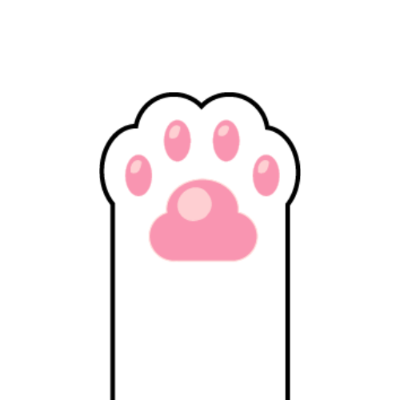

# Pawng 🐾

Pawng is a modern, mobile-oriented reimagining of the classic Pong game, built with the **Godot Engine 4.5**. Featuring adorable paw-themed aesthetics, it offers both solo play against an AI and local multiplayer for competitive fun on a single device.



## 🌟 Features

- **Single Player Mode**: Test your skills against a smart AI that dynamically tracks the ball.
- **Two Player Mode**: Compete with a friend on the same screen with touch-optimized controls.
- **Mobile Optimized**: Designed for a vertical (portrait) orientation with a native 720x1280 resolution.
- **Dynamic Difficulty**: The ball increases in speed with every bounce, keeping every round intense.
- **Polished Visuals**: Smooth transitions, scale-in effects on ball reset, and custom paw-themed assets.

## 🕹️ Controls

- **Single Player**: Drag your finger (or mouse) across the bottom half of the screen to move your paw.
- **Two Player**:
  - **Top Player**: Controls the top paw by dragging on the top half of the screen.
  - **Bottom Player**: Controls the bottom paw by dragging on the bottom half of the screen.

## 🛠️ Technical Details

### Architecture
- **Engine**: Godot 4.5 (Mobile Renderer).
- **Language**: GDScript.
- **Resolution**: 720x1280 (Portrait).
- **Physics**: Utilizes `CharacterBody2D` for both players and the ball, with `move_and_collide` for precise bounce logic.

### Core Components
- `ball.gd`: Manages ball movement, speed multipliers, and the "shrink-to-reveal" reset animation using Tweens.
- `player.gd`: A versatile script handling both human input and AI logic.
- `main.gd`: Handles game state, goal detection, and scene transitions.
- `main_menu.gd`: User interface management for navigating between game modes.

## 🚀 Getting Started

1. **Clone the repository**:
   ```bash
   git clone https://github.com/Xain-Ul-Abedin/Pawng-Godot-Ongoing.git
   ```
2. **Open in Godot**: Launch Godot 4.5 and import the `project.godot` file located in the `Pawng-Godot-Ongoing` directory.
3. **Play**: Press F5 to run the project.

## 🎨 Assets
The project includes custom-designed paw assets and buttons located in the `Assets/` directory.

---
*Created with ❤️ by Zain-Ul-Abedin*
